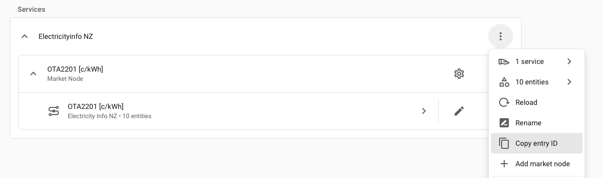

# Electricityinfo NZ

[![HACS][hacsbadge]][hacs]
[![GitHub Release][releases-shield]][releases]
[![Integration Usage][downloads-shield]][downloads]

[![Home Assistant][ha-shield]][ha]
[![Python Version][python-shield]][python]
[![License][license-shield]](LICENSE)

[![Tests][tests-shield]][tests]
[![Code Style: Ruff][ruff-shield]][ruff]
[![GitHub Activity][commits-shield]][commits]

Home Assistant custom integration for [Electricityinfo NZ](https://electricityinfo.co.nz) wholesale electricity prices. Track real-time and forecast spot prices at New Zealand grid reference nodes, directly in Home Assistant.

## Features

- **Live price sensor** — real-time RTD (Real-Time Dispatch) price, updated every 5 minutes, restored on restart; includes `history` attribute with recent RTD periods
- **Forecast sensors** — day-ahead (24 h / 48 periods) and intraday (4 h / 8 periods), each with `forecast` and `history` attributes
- **Accounting sensors** — settled price, per-period import cost & export revenue, daily accumulated totals, and previous-day totals (requires energy meter entities; utility meter helpers not supported)
- **Multiple market nodes** — add as many nodes as you need, each independently configured
- **Choice of price unit** — c/kWh or NZD/kWh per market node
- **5-minute refresh cycle** — live price updates every 5 minutes; forecast and accounting data also refreshes at the same cadence
- **HACS installable**

> **Note:** RTD prices are published approximately every 5 minutes. Forecast and accounting schedules update at `:00` and `:30` each hour. After a Home Assistant restart, the integration resumes its 5-minute polling cycle from startup time. To realign forecast/accounting refreshes with schedule boundaries, reload the integration at `:02` or `:32` (or use the automation example below).

---

## Prerequisites

You need API credentials from [developer.electricityinfo.co.nz](https://developer.electricityinfo.co.nz/WITS/login):

1. Register for an account at the developer portal
2. Create an application to obtain a **Client ID** and **Client Secret**
3. The free tier is sufficient for personal Home Assistant use

---

## Installation

### HACS (recommended)

[](https://my.home-assistant.io/redirect/hacs_repository/?owner=dan-s-github&repository=ha-electricityinfo-nz&category=Integration)

Click **Download** in HACS, then restart Home Assistant.

### Manual

1. Download the latest release from [GitHub Releases][releases]
2. Copy the `custom_components/electricityinfo` folder into your Home Assistant `config/custom_components/` directory
3. Restart Home Assistant

---

## Setup

### 1. Add the integration

Go to **Settings → Devices & Services → Add Integration** and search for **Electricityinfo NZ**.

Enter your **Client ID** and **Client Secret**. Home Assistant will validate the credentials against the API before saving.

### 2. Add a market node

After the integration is set up, add market nodes via **Settings → Devices & Services → Electricityinfo NZ → Add market node**.

Each market node creates a **device** containing the sensor entities you enable:

| Field | Description | Required |
|---|---|---|
| **Node** | Grid reference node (see below) | Yes |
| **Price unit** | `c/kWh` or `NZD/kWh` | Yes |
| **Enable live price** | Real-time dispatch price sensor | No (default: on) |
| **Enable forecast** | Day-ahead and/or intraday forecast sensors | No (default: off) |
| **Forecast type** | `Price-responsive` (PRSL/PRSS) or `Non-responsive` (NRSL/NRSS) | If forecast on |
| **Forecast horizons** | `Day-ahead` (24 h / 48 periods), `Intraday` (4 h / 8 periods), or both | If forecast on |
| **Forecast retention** | Hours of history to keep in the `history` attribute (6, 12, or 24 h) | No (default: 24 h) |
| **Enable accounting** | Settled price and import/export cost sensors | No (default: off) |
| **Accounting retention** | Hours of settled-price history to keep (24 or 48 h) | No (default: 24 h) |
| **Import meter** | Energy sensor entity for import kWh (e.g. your smart meter or Riemann sum helper) | If accounting on |
| **Export meter** | Energy sensor entity for export kWh (must differ from import meter) | No |

To edit or remove a market node, go to its device page and use **⋮ → Reconfigure** or **Delete**.

---

## Sensor Entities

Each market node device creates up to eight entities depending on which features are enabled.

### Live Price

| Entity | Unit | Description |
|---|---|---|
| `sensor.<node>_live_price` | c/kWh or NZD/kWh | Most recently dispatched RTD price |

**Attributes:**

| Attribute | Description |
|---|---|
| `timestamp` | ISO 8601 datetime of the dispatched RTD period |
| `trading_period` | WITS trading period number (1–48) |
| `node` | Grid reference node code |
| `schedule` | Always `RTD` |
| `history` | List of recent RTD periods (up to `back=3`), sorted oldest→newest: `{timestamp, trading_period, price, node, schedule}` |

State is restored across Home Assistant restarts (discarded if older than 30 minutes).

### Forecast Sensors

One sensor per enabled horizon: **Day Ahead Forecast** (`day_ahead_forecast`) and/or **Intraday Forecast** (`intraday_forecast`).

| Entity | Unit | Description |
|---|---|---|
| `sensor.<node>_day_ahead_forecast` | c/kWh or NZD/kWh | Current period price from day-ahead schedule (PRSL or NRSL) |
| `sensor.<node>_intraday_forecast` | c/kWh or NZD/kWh | Current period price from intraday schedule (PRSS or NRSS) |

**Attributes** (both sensors):

| Attribute | Description |
|---|---|
| `forecast` | List of future periods: `{period_start, trading_period, price}` |
| `history` | List of past periods within the retention window: `{period_start, trading_period, price}` |

Example:
```yaml
forecast:
  - period_start: "2026-05-09T12:30:00+12:00"
    trading_period: 25
    price: 9.12
  - period_start: "2026-05-09T13:00:00+12:00"
    trading_period: 26
    price: 8.85
```

### Accounting Sensors

Requires **Enable accounting** to be turned on.

| Entity | Unit | Description |
|---|---|---|
| `sensor.<node>_settled_price` | c/kWh or NZD/kWh | Most recent settled price (Interim schedule); includes `history` attribute |
| `sensor.<node>_import_cost` | c or NZD | Electricity cost for the current settled period (import energy × settled price) |
| `sensor.<node>_export_revenue` | c or NZD | Export revenue for the current settled period (export energy × settled price) |
| `sensor.<node>_daily_import_cost` | c or NZD | Running daily total import cost (resets at midnight NZT) |
| `sensor.<node>_daily_export_revenue` | c or NZD | Running daily total export revenue (resets at midnight NZT) |
| `sensor.<node>_previous_day_import_cost` | c or NZD | Total import cost for the previous day (snapshot at midnight NZT) |
| `sensor.<node>_previous_day_export_revenue` | c or NZD | Total export revenue for the previous day (snapshot at midnight NZT) |

`import_cost` and `export_revenue` require a meter entity to be configured. Import and export meters must be **different entities**.

#### Meter entity requirements

The import and export meter entities must satisfy all of the following:
- `device_class` = `energy`
- `unit_of_measurement` = `kWh`
- **No** `last_reset` attribute — utility meter helpers with a fixed reset period are not supported; use a monotonically increasing cumulative sensor or a [Riemann Sum helper](https://www.home-assistant.io/integrations/integration/) instead

> **Note:** Utility meter helpers (created via **Settings → Helpers → Add helper → Utility meter**) add a `last_reset` attribute and are rejected. Riemann sum integral helpers built from a power (W) sensor are accepted and recommended.

---

## Forecast Schedules

The integration automatically selects the correct WITS API schedule based on your **Forecast type** setting:

| Forecast type | Day-ahead | Intraday |
|---|---|---|
| Price-responsive | PRSL (48 periods) | PRSS (8 periods) |
| Non-responsive | NRSL (48 periods) | NRSS (8 periods) |

The **live price sensor** uses the dedicated RTD (Real-Time Dispatch) schedule — a separate API call made only when `Enable live price` is on. RTD prices reflect actual dispatched prices, not forecasts.

---

## Grid Reference Nodes

Nodes are the grid injection/offtake points used by the WITS market. The node picker in the config flow lists all 246 NZEM wholesale pricing nodes, each shown as `CODE (Site, Island)` — choose the node geographically closest to you or relevant to your region.

The list is sourced from the Electricity Authority's [Final Energy Prices dataset](https://www.emi.ea.govt.nz/Wholesale/Datasets/DispatchAndPricing/FinalEnergyPrices) (every node with a settled wholesale price) and cross-referenced against EMI's [Network Supply Points Table](https://www.emi.ea.govt.nz/Wholesale/Datasets/MappingsAndGeospatial/NetworkSupplyPointsTable) for site names. A handful of nodes have no published site name and appear as their code only.

### Finding the right node for your location

The node picker is a searchable dropdown — start typing your town or suburb name and matching nodes will filter as you go (e.g. typing "hamilton" surfaces `HAM0111`, `HAM0331`, `HAM0551`, `HAM2201`).

The Electricity Authority itself has no address-to-node lookup (their own forum says as much when asked), but a few other resources get you there:

- **Search by nearest town/substation.** Most nodes are named after the substation or town they serve. Pick the node whose site name is geographically closest to you.
- **Transpower's [Envision map](https://experience.arcgis.com/experience/007dcdef2909420ba7420377a22799d0/page/HOME)** is an interactive, nationwide GIS map of the transmission grid, including substations and GXPs — the closest thing to a real "find it on a map" tool.
- **Your local lines company may publish its own GIS map.** Check your power bill for your network (e.g. Vector in Auckland, Wellington Electricity, Orion in Christchurch, Unison in Hamilton/Rotorua/Hawke's Bay) — Vector, for example, publishes an [open-data network map](https://data.vector.co.nz/maps/45a165ecd0aa432484bedf1e9de9cf9d) showing zone substations, which you can cross-reference against the node names in the picker.
- **For exact coordinates**, EMI's [Network Supply Points Table](https://www.emi.ea.govt.nz/Wholesale/Datasets/MappingsAndGeospatial/NetworkSupplyPointsTable) CSVs include NZTM easting/northing per site.
- **Exact precision isn't critical.** Wholesale prices at neighbouring nodes are usually within a few cents of each other (they diverge mainly around transmission constraints or big island-crossing events). Picking the closest reasonable node is normally good enough — you can always change it later via **⋮ → Reconfigure** on the node's device page.

---

## Usage Examples

### Lovelace — current live price card

```yaml
type: entity
entity: sensor.ota2201_live_price
name: Spot Price
icon: mdi:flash
```

### Lovelace — day-ahead forecast chart (ApexCharts)

With [ApexCharts Card](https://github.com/RomRider/apexcharts-card):

```yaml
type: custom:apexcharts-card
header:
  show: true
  show_states: true
  colorize_states: true
graph_span: 24h
span:
  start: hour
now:
  show: true
  label: now
  color: red
series:
  - entity: sensor.ota2201_c_kwh_day_ahead_forecast
    name: Current
    unit: " c/kWh"
    float_precision: 3
    show:
      in_chart: false
      in_header: true
  - entity: sensor.ota2201_c_kwh_day_ahead_forecast
    name: Forecast
    type: column
    show:
      in_chart: true
      in_header: false
    data_generator: |
      return (entity.attributes.forecast || []).map(f => [
        new Date(f.period_start).getTime(),
        Number(f.price)
      ]);
yaxis:
  - min: 0
    decimals: 3
```

### Automation - Reload Integration After HA Restart

Use this automation if Home Assistant restarts just after a schedule boundary and you want to realign updates quickly:

```yaml
alias: Reload Electricityinfo After HA Start
description: >-
  Wait for the next xx:x1 or xx:x6 minute mark (1 minute past each 5-minute
  price update) within the first hour after Home Assistant starts, then
  reload the Electricityinfo config entry.
triggers:
  - trigger: homeassistant
    event: start
conditions: []
actions:
  - wait_template: "{{ now().minute % 5 == 1 }}"
    continue_on_timeout: true
    timeout: "01:00:00"
  - choose:
      - conditions:
          - condition: template
            value_template: "{{ wait.trigger is not none and wait.trigger.timeout }}"
        sequence:
          - action: persistent_notification.create
            data:
              title: Electricityinfo Reload Timeout
              message: >-
                Timed out waiting for the next xx:x1 or xx:x6 minute mark to
                reload the Electricityinfo integration.
              notification_id: electricityinfo_reload_timeout
    default:
      - action: homeassistant.reload_config_entry
        data:
          entry_id: YOUR_CONFIG_ENTRY_ID
mode: single
```

Find `YOUR_CONFIG_ENTRY_ID` under **Settings -> Devices & Services -> Electricityinfo NZ -> ⋮ -> Copy entry ID**:



---

## Update Behaviour

- Prices refresh every **5 minutes**
- On Home Assistant restart, the last known live price is **restored immediately** (no waiting for first fetch) — provided the saved price is less than 30 minutes old
- If the API is unreachable, the integration retries after 1 minute, then marks sensors **unavailable** after a second failure; they recover automatically when the API returns

---

## Troubleshooting

### Sensors show "Unavailable"

- Check your API credentials are still valid at [developer.electricityinfo.co.nz](https://developer.electricityinfo.co.nz/WITS/login)
- Check Home Assistant has internet access
- Check the integration logs: **Settings → System → Logs**, filter for `electricityinfo`

### Updating your API credentials

If your Client ID or Client Secret changes (or Home Assistant flags the integration as needing re-authentication), you don't need to remove and re-add the integration — your market node sensors would be lost. Instead, go to **Settings → Devices & Services → Electricityinfo NZ → ⋮ → Reconfigure** and enter the new credentials.

### Forecast attribute is empty

- The API may not have published forward prices for the selected node yet — retry after the next `:00` or `:30`
- Check the forecast horizons selected in the market node configuration

### Accounting sensors show "Unavailable"

- Confirm your import/export meter entities are `energy` device class sensors with `kWh` unit of measurement and **no** `last_reset` attribute (utility meter helpers are not supported — use a Riemann sum integral helper instead)
- Import and export meters must be different entities; configuring the same entity for both is rejected at setup
- The settled price sensor requires the Interim schedule to have published a settled price for the current period
- Previous-day sensors show the snapshot taken at midnight NZT — they will be unavailable until the first midnight rollover after the integration is set up

### Prices seem wrong

- These are wholesale WITS spot prices, not retail prices
- The integration uses c/kWh or NZD/kWh — if a price looks 1000× too high, you may be comparing c/kWh with NZD/MWh from another source

---

## Development

```bash
uv sync              # install dependencies
pytest tests/        # run tests (mocked API)
ruff check --fix     # lint
mypy custom_components/  # type check
```

See [CONTRIBUTING.md](CONTRIBUTING.md) for contribution guidelines.

---

[releases-shield]: https://img.shields.io/github/release/dan-s-github/ha-electricityinfo-nz.svg?style=flat&logo=github
[releases]: https://github.com/dan-s-github/ha-electricityinfo-nz/releases
[downloads-shield]: https://img.shields.io/badge/dynamic/json?color=41BDF5&logo=home-assistant&label=integration%20usage&suffix=%20installs&cacheSeconds=15600&url=https://analytics.home-assistant.io/custom_integrations.json&query=%24.electricityinfo_nz.total
[downloads]: https://analytics.home-assistant.io/custom_integrations/electricityinfo_nz
[commits-shield]: https://img.shields.io/github/commit-activity/y/dan-s-github/ha-electricityinfo-nz.svg?style=flat&logo=github
[commits]: https://github.com/dan-s-github/ha-electricityinfo-nz/commits/main
[license-shield]: https://img.shields.io/github/license/dan-s-github/ha-electricityinfo-nz.svg?style=flat
[python-shield]: https://img.shields.io/badge/python-3.14+-blue.svg?style=flat&logo=python&logoColor=white
[python]: https://www.python.org/
[ha-shield]: https://img.shields.io/badge/Home%20Assistant-2026.3.0+-blue.svg?style=flat&logo=homeassistant&logoColor=white
[ha]: https://www.home-assistant.io/
[tests-shield]: https://img.shields.io/github/actions/workflow/status/dan-s-github/ha-electricityinfo-nz/ci.yml?branch=main&style=flat&logo=github
[tests]: https://github.com/dan-s-github/ha-electricityinfo-nz/actions/workflows/ci.yml
[ruff-shield]: https://img.shields.io/badge/code%20style-ruff-000000.svg?style=flat&logo=ruff&logoColor=white
[ruff]: https://github.com/astral-sh/ruff
[hacs]: https://github.com/hacs/integration
[hacsbadge]: https://img.shields.io/badge/HACS-Custom-orange.svg?style=flat&logo=homeassistant&logoColor=white
[issues]: https://github.com/dan-s-github/ha-electricityinfo-nz/issues
